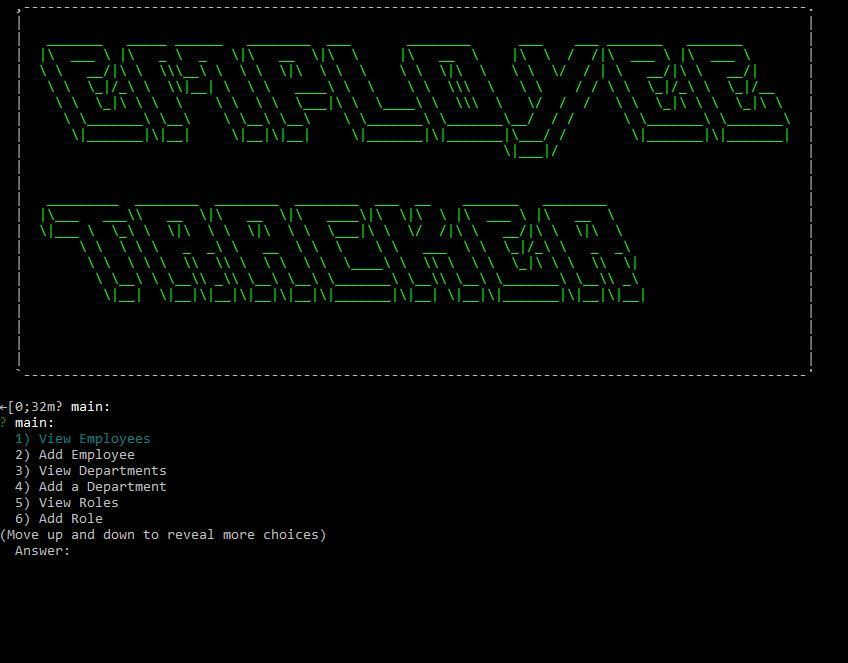

# Employee Tracker 2.0  
  
  
  This project is to have an EMS system operated through a CLI

  --------
  ## Installation 
  use NPM to install inquirer, asciiart-logo, and mysql. View JSON file for more

  --------
  ## Demonstration
  
  
 
 https://youtu.be/LZTXkrwZDU4
  
  --------
  ## Questions 

  Find all my other projects at [Github](https://github.com/ahuffma2)

  If you need to reach me please contact me at my email 

  austinhuffman0@gmail.com
